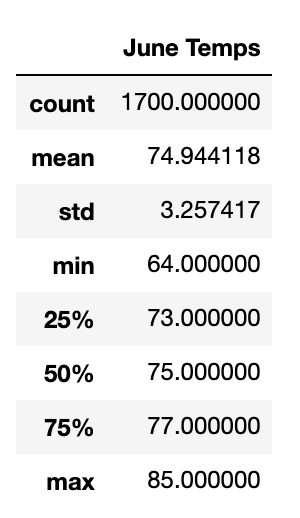
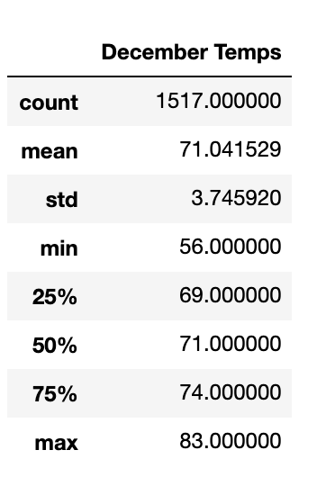

# Surfs Up Analysis

## Overview of The Statistical Analysis

### Purpose 
The purpose of this analysis is to supply information to present to an investor in order to fulfill a goal to live in Hawaii and building a Surf n Shake shop. The investor is concerned with the weather in Hawaii and has asked us to provide information about temperature trends before opening the surf shop. He wants temperature data for the months of June and December in Oahu, in order to determine if the surf and ice cream shop business is sustainable year-round.  From the analysis for the months of June and December for years 2010 to 2017, it seems like the weather condition is perfect in the month of June and December. Surf n Shake shop should be invested in and will be a great hit!

## Results

This shows that June is warmer than December.

#### June Data

#### December Data

### Differences Between June and December
- In June the average temperature is 74.9 degrees F and for December the average temperature is 71.0 degrees F.
- In June the minimum temperature is 64 degrees F and for December the minimum temperature is 56 degrees F.
- In June the maximum temperature is 85 degrees F and for December the maximum temperature is 83 degrees F.

## Summary

In comparing between June and December, both months will be suitable for the Surf n Shake shop. June may have a higher customer count compared to December as the weather maybe a little chillier. The standard deviation for both months is pretty high which indicates that the weather is spread out over a wider range of temperatures but still within the maximum and minimum.  The result shows that the shop will be successful in either summer and winter months. Two additional queries that can be included to perform further analysis to gather more weather data for June and December would be looking into precipitation those months to see how rain can affect the business and the second query would be find the most active stations in 2010 - 2017 and compare their temperatures for the month of June and December. 
